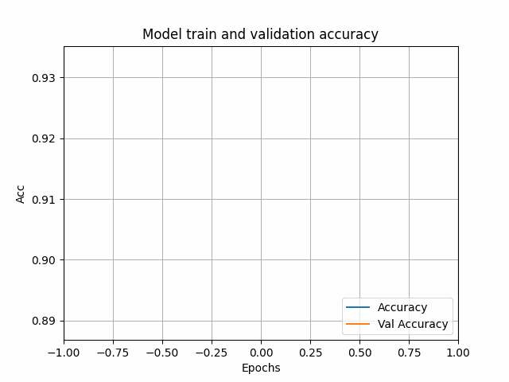
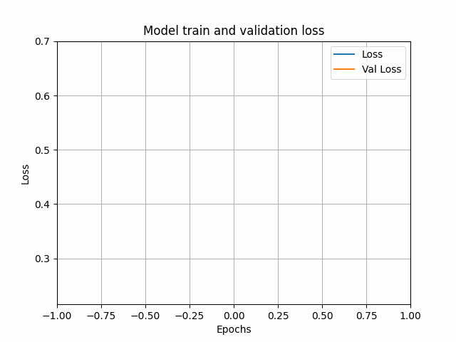

# Number Detector

## Training process:
Architekture:

Accuracy:

Loss:

Plots generated with open_atmos_jupyter_utils
## How it works:
1. Open the terminal and navigate to the folder where the number_detector.py file is saved.

2. Run the program with the command:
   'python number_detector.py'

3. You'll see the following menu:

4. The option "Explanation of how the program works" briefly describes what the program does.

6. The "Load image" option lets you choose a specific 28x28 image file from the menu_data folder.
You can also add your own images, as long as they match the resolution of the sample data.

7. The "Start" option allows you to recognize the digit in the selected image.
It returns the predicted number and the model's confidence level.

8. The "Display selected image" option opens a window with the currently loaded image.

9. The "Exit" option closes the program.

